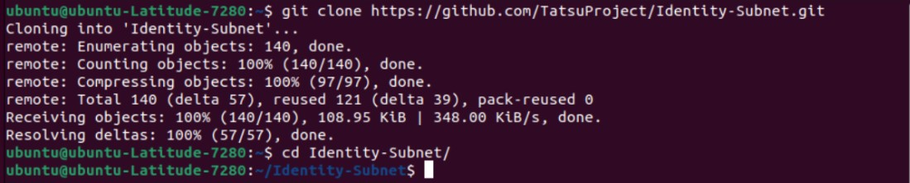
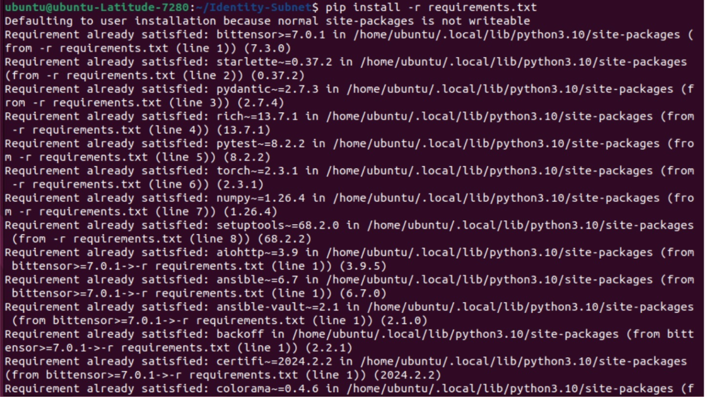
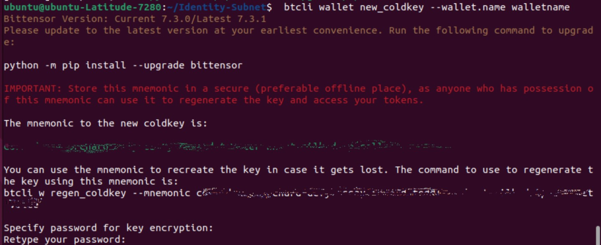
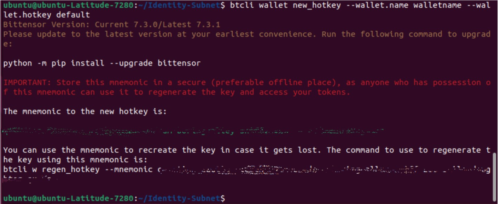
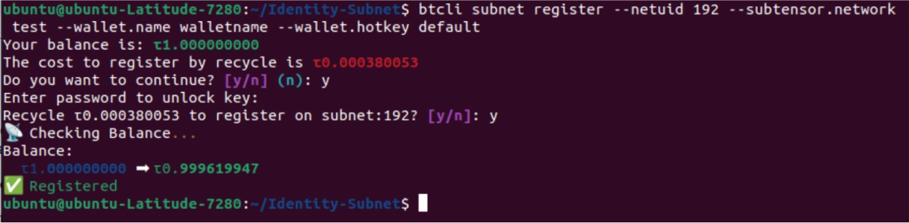
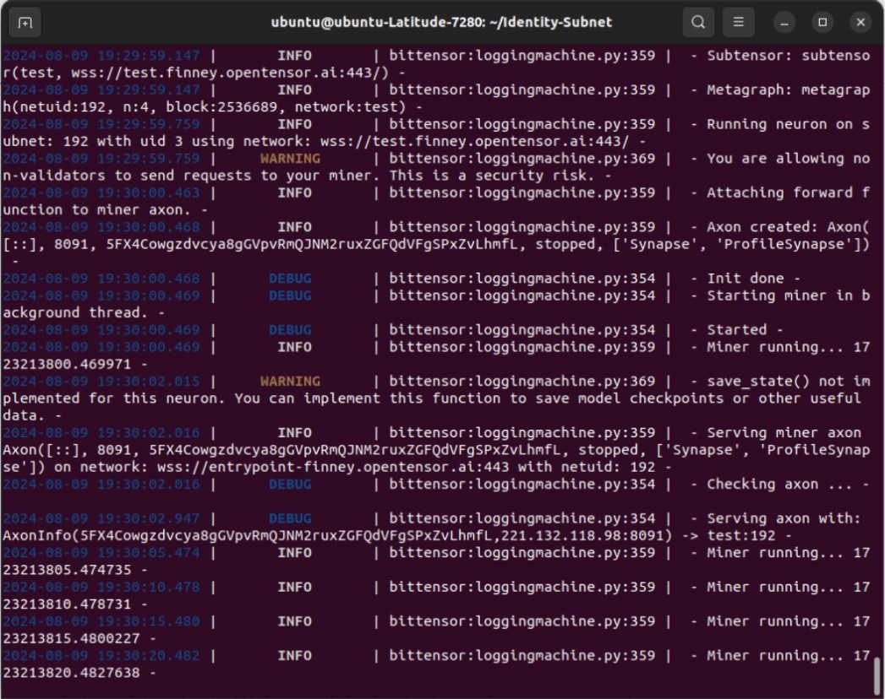
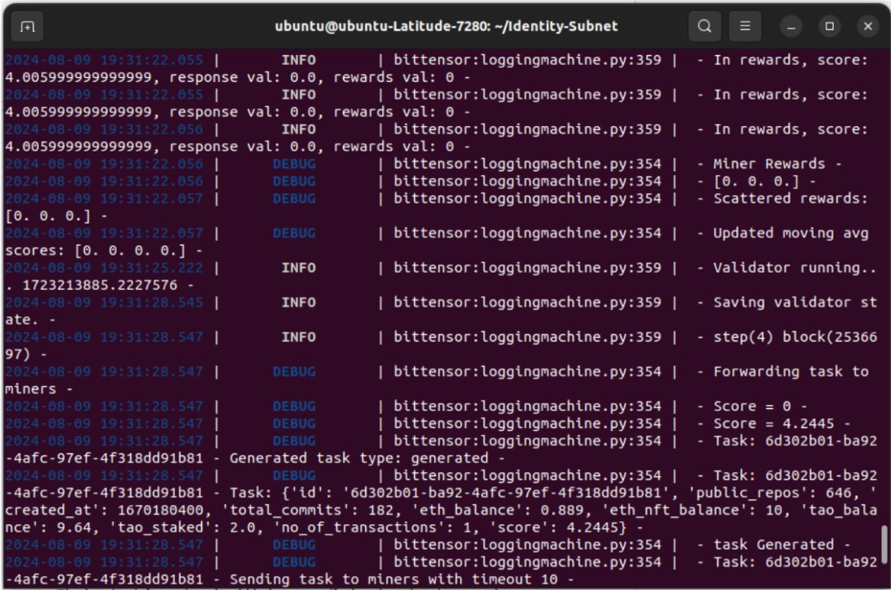

# Technical Guide

## System Requirements

| Items               | Required  | Recommended |
|---------------------|-----------|-------------|
| **CPU Physical Cores** | 4         | 8           |
| **CPU Speed**       | 2.5GHz     | 3.0GHz      |
| **RAM**             | 8GB        | 16GB        |
| **Storage**         | 10GB       | 50GB        |
| **Operating System** | Ubuntu 20.04 | Ubuntu 24.04 |
| **Bandwidth**       | 100Mbps/20Mbps | -        |

## Step-by-Step Guide to Running a Miner/Validator on Ta𝜏su Identity Subnet

To run a miner/validator on the Ta𝜏su Identity Subnet for testing, you can use the instructions provided in the `[running_on_testnet.md](https://github.com/TatsuProject/Identity-Subnet/blob/main/docs/running_on_testnet.md)` file from the repository.
To run a miner/validator on the Ta𝜏su Identity Subnet on the mainnet, you can use the instruction provided in the `[running_on_mainnet.md](https://github.com/TatsuProject/Identity-Subnet/blob/main/docs/running_on_mainnet.md)`

### Prerequisites:

- Ensure you have Python installed (preferably version 3.7 or higher).
- Install Git for cloning the repository.
- Ensure you have a suitable text editor or IDE for editing configuration files.

### Steps:

1. **Clone the Repository:**

    ```bash
    git clone https://github.com/TatsuProject/Identity-Subnet.git
    ```

    Navigate to the project directory:

    ```bash
    cd Identity-Subnet
    ```
    
2. **Install Dependencies:** 

    Ensure you have pip installed, then install the necessary Python packages:

    ```bash
    pip install -e .
    pip install -r requirements.txt
    ```
    
3. **Generate Wallet Keys:**

    To participate as a miner, you need to set up wallet keys. You can specify the name you want for the wallet:

    ```bash
    btcli wallet new_coldkey --wallet.name "NAME"
    ```
    
    This will generate a new wallet and return the coldkey for that wallet. Remember to keep this key secure. Now create a hotkey for the wallet you just created:

    ```bash
    btcli wallet new_hotkey --wallet.name "NAME" --wallet.hotkey default
    ```
    
    This command will generate a hotkey and coldkey for your miner wallet. Securely store the generated keys. And use any faucet to get Tao in your wallet.

4. **Register Keys**

    This step registers your subnet validator or subnet miner keys to the subnet. Depending on what you are planning to do, you can choose either of these four commands

    Register your miner key to the subnet on **TESTNET**:

    ```bash
    btcli subnet register --netuid 192 --subtensor.network test --wallet.name miner --wallet.hotkey default
    ```
    

    Register your miner key to the subnet on **MAINNET**:

    ## OR
    Register your validator key to the subnet on **TESTNET**:

    ```bash
    btcli subnet register --netuid 192 --subtensor.network test --wallet.name validator --wallet.hotkey default
    ```
    


6. **Run the Process:**


    Use the following command to start the miner on **TESTNET**:

    ```bash
    python3 neurons/miner.py --netuid 192 --subtensor.network test --wallet.name "NAME" --wallet.hotkey default --logging.debug
    ```
    

    ## OR

    Use the following command to start the Validator on **TESTNET**:

    ```bash
    python3 neurons/validator.py --netuid 192 --subtensor.network test --wallet.name validator --wallet.hotkey default --logging.debug
    ```
    


8. **Monitor and Verify:**

    - Monitor the console output to ensure the miner/validator is running correctly.
    - The logging information should help you verify that the miner is correctly processing data and communicating with the network.
